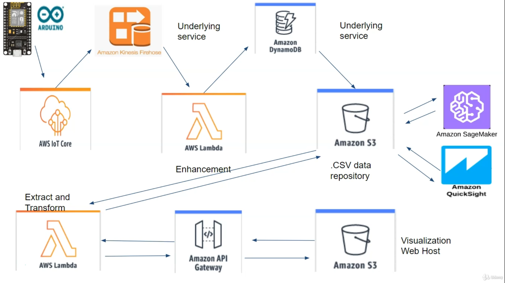
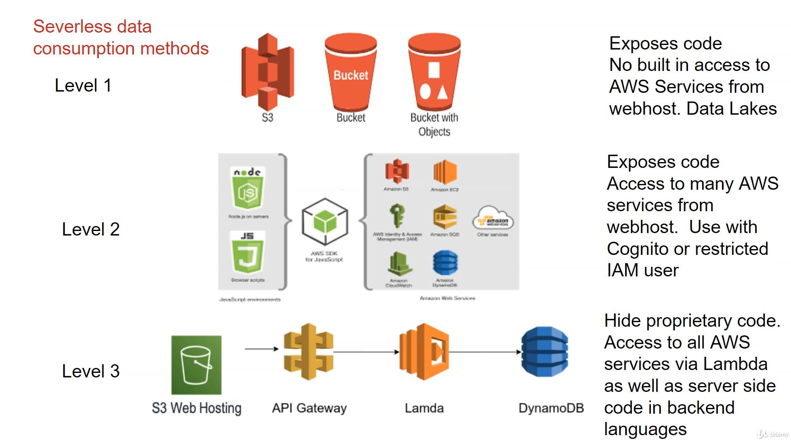

# AWS Serverless Design for IoT

## Fonts

https://www.udemy.com/course/aws-serverless-design-for-iot/

## Goal

Understand the proposal from AWS resources to resolve a serverless IoT Design

## Architecture

#### Advanced Architecture

#### 3 Levels Architectures

### Default

"WebHook" from IoT Core calling Lambda Function to execute something

### Level 1

Publish data from device using HTTP to S3 bucket OR Publish using IoT Core with lambda function to populate S3

Populate the bucket with json files (data published)

Consume the data with JavaScript hosted on S3 index.hml

### Level 2

From WebHook poulate a DynamoDB.

To restore  the data use AWS SDK to connect using authentication to DynamoDB

### Level 3

S3 WebHosting Index.html with JavaScript Calling REST API from API Gateway that executes a Lambda Function that restore data from DynamoDB

## Services

#### S3:

Amazon  Simple Storage Service (S3). Service to store objects (NFS?!)

#### DynamoDB:

NoSQL Database

#### API Gateway:

self explanatory

#### Lambda:

Serverless Functions

#### IoT Core:

MQTT Service

#### IAM:

Identity and Acces Management

